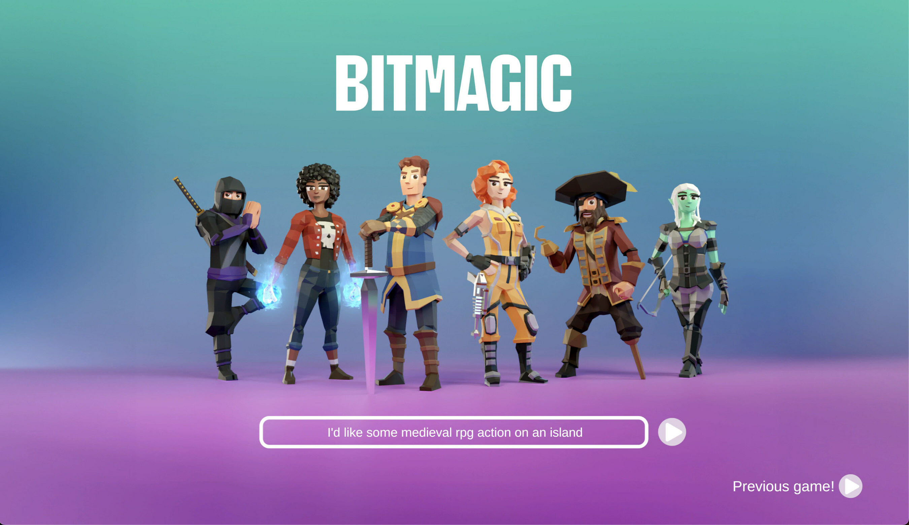

 

	<h2 class="section-heading text-uppercase"> Co-founder </h2>

As a co-founder of Bitmagic, I helped <b>drive the vision</b> to revolutionise the way games and stories are created and experienced. While our original concept was ambitious, we quickly realised it was too complex to execute all at once. We <b>pivoted</b>, focusing on one of our AI tools, and restructured the team to align with this new direction. I stepped away from the company during this transition.

During my time I <b>lead foundational research efforts</b> to ground our work on actual user needs and experiences, acted as a <b>producer for the design team</b>, and championed <b>culture building efforts</b> in the entire company.

Through this experience, I gained invaluable insights into <b>building a product and company from the ground up.</b>