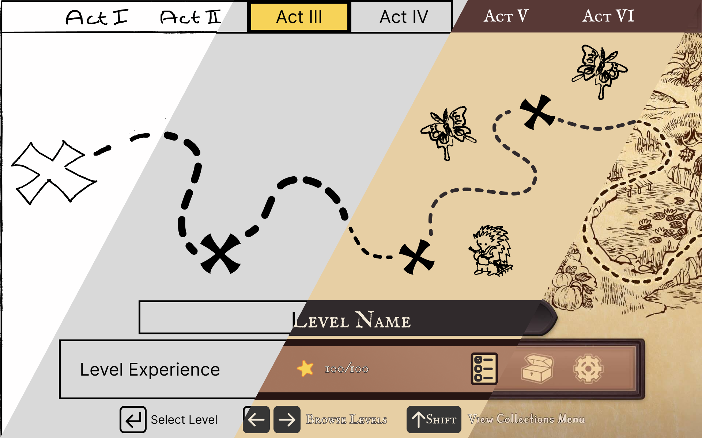

 

	<h2 class="section-heading text-uppercase"> Creating a UI Pipeline </h2>

<h3>Initial Challenge: Disjointed UI Development</h3>
When I first joined a game project at Frozenbyte, I was asked to quickly check the menus and their navigation before they were implemented. Timeline for this entire process (check and implementation) was <b>one month</b>. In reality it took <b>over 6 months</b> to finalise the menus.

When the team shifted to the next project, the UI artist and I decided to ensure the UI pipeline was much more efficient in this and future projects.

The existing process, where each menu screen was treated as an individual feature completely detached from other menus, led to <b>redundant work, inconsistent designs, and inefficient use of resources</b>. This created <b>a fragmented user experience</b> and <b>a general unenthusiasm toward UI development</b> in programmers.

For example, Nine Parchments shipped with <i>over 20 different shades of yellow used for highlights</i> across all menus and changing each needed to be tasked separately.

<h3>Solution: Style Guide</h3>
To avoid this the UI artist and I created a style guide. It ensured <b>consistency in design, reduced redundant</b> work by programmers, and allowed for <b>faster implementation</b> of UI elements and entire menus.

We opted to <b>not build a full design system</b>, as the point was to lessen the workload on programmers and we <b>didn’t have their full buy-in</b> for this project at the start.

This helped streamline the UI design and creation process significantly, by improving communication and shared understanding. It not only streamlined our design process, but also provided programmers with clear guidelines, reducing ambiguity, and speeding up implementation across all the teams involved in UI development. The style guide also had the added benefit of improving the accessibility of our games as the UI was more accessible by default as the accessibility features needed to be defined only once for each UI element.

<h3>Results: Reduced Development Time by 50%</h3>
Through this and prototyping efforts introduced in <i>Trine 4</i> the UI creation process was reduced by more than half <b>from approximately 36 man months</b> for <i>Nine Parchments</i> <b>to 16 man months</b> for <i>Trine 4</i>. This UI pipeline was adopted through all the projects in the entire company.
