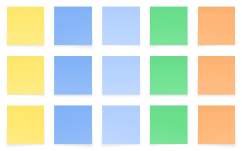

 

	<h2 class="section-heading text-uppercase"> Facilitation </h2>

The larger the team grows and the longer they work together, the easier communication breaks apart. While best practice is to communicate early and often, there are times when you taking a deliberate moment to focus on seemingly non-urgent things such as team alignment, culture and ways of working, building a shared vision and a roadmap to the future, or looking back and learning from mistakes and successes already past.

I’ve shepherded multiple teams through discussions like this and would love to help yours. Below are some examples of sessions and workshops I’ve run.

<h3>Team alignment</h3>
The more team members there are and the more time passes, the more likely it is that there are <b>breaks in communication</b> and <b>misalignment</b> within the team.

I’ve designed and run custom made workshops to realign teams, surface and address any frustrations the team is harbouring, and build momentum within the entire team.

For example, the <i>Boreal Blade</i> team was completely misaligned on what kind of game they were making and frustrations were mounting as the team was moving from the iteration to polish phase of development. After guiding them through the creation of a <i>Game Design Document</i>, they had a <i>shared language and understanding</i> of what they were doing, and a way to address any changes that were not communicated clearly.

<h3>Team culture building</h3>
Team culture consists of the <b>values, goals, and ways of working</b> that the team has.

I have designed and run workshops to allow teams to define and codify their cultures. This has improved the team’s <b>communication, efficiency, and overall satisfaction</b> from the end of the workshop long into their future.

For example, as a young studio, the team at Bitmagic found itself in a place where the team was split into small factions with mistrust and even hostility growing between each. After a <i>half-day workshop</i>, the team felt more connected to each other and safe to proceed with their work.

<h3>Roadmapping</h3>
Even when teams are aligned, it is sometimes difficult to prioritise all the tasks at hand. Especially when the team is diverse, the amount of tasks brought to the table can feel overwhelming without a <b>shared vision.</b>

I’ve run Design Sprints and other workshops to clarify team vision, <b>goals</b>, and the way to reaching both.

For example, the design team at <i>Bitmagic</i> had grand ideas, but struggled to gain momentum. I ran a <i>weeklong workshop</i> to help the team solidify a shared vision, clarify goals based on that vision, define <i>milestones</i> for the next six months, and build a roadmap to them. This helped the team and management <i>regain confidence and rebuild momentum</i> that had been lost.

<h3>Post Mortem</h3>
All too often teams feel the project is completed once the product or phase is finished. This thinking robs the team and company from learning from the project and its <b>successes and failures.</b>

For example, I was in charge of two internal projects at <i>Redhill Games</i>. After they ended, I ran a post-mortem for each team. I gathered information from them with a survey beforehand and designed the content of the half-day workshop based on the main points that arose from the survey. One team focused on a sense of <i>ownership and communication</i> in their session as they had struggled with both. The other team focused on defining the <i>structure and guidance future projects would need</i>, as these were the things that had caused their team the most issues. While the topics were difficult, both teams gleaned many insights valuable both on the individual and company level. One participant told me: <i>“I have never been in a better organised or thought-out post-mortem, and I’ve seen and even run quite a few.”</i>

<h3>Workshops</h3>
I have created multiple interactive workshops to teach teams and groups <b>new skills</b>. These include <b>design thinking, accessibility design,</b> and how to use <b>specific technical tools</b>. After each, the participants have walked away with tangible skills or practical ideas to take back to their work.

For example, I ran a <i>half-day workshop on Game UX</i> that covered what <i>UX Design and UX Research</i> are, why they matter through practical examples and <i>hands-on exercises</i> for game developers and students. Feedback stated they learned <i>new concepts</i> and mental models with which to approach design as well as a newfound appreciation of the discipline.