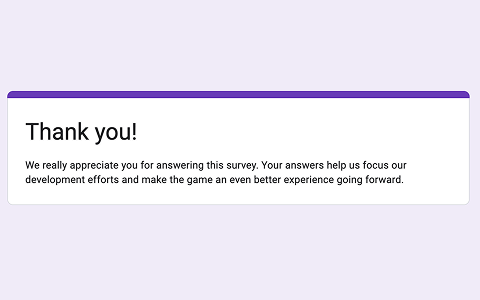

 

	<h2 class="section-heading text-uppercase"> Setting Up a User Research Function </h2>

<h3>Initial Challenges</h3>
While Frozenbyte had a user research process when I joined the company, it <b>lacked ownership and focus</b>, which lead to <b>unfocused insights</b> and missed opportunities for actionable feedback.

The established user research process was this:
Once the game was near shipping and almost completely polished, they would invite players over to their offices to play the game and give feedback on it.

The support team would organise and moderate these sessions. They would take <i>the latest build</i> on the day of the test, <i>record the entire session</i>, and inform the game team that the videos were available for them. The more tests they ran, especially on the same game, the better observations they could make during the sessions, and flag issues directly with the team immediately after the playtest session was over.

Over the years they have learned a lot about player perception and thinking through this process. But this learning was unfocused, unstructured, and unappreciated.

Over my tenure at Frozenbyte, I improved the process is multiple ways.

<h3>Identifying Key Issues</h3>
I understood that the biggest issue blocking us from getting more out of our playtests was the <b>lack of clear research questions</b>. The moderators, and myself, had anticipated one, but often defaulted into “we’ll log everything we see”. As a research question was never required, the teams didn’t know to pose any, thinking they'd "know the issues when they saw them".

Another issue was the <b>lack of interaction between designers and playtest moderators</b>. The moderators were removed from the design decisions and the questions the designers were grappling with. They also didn't have the training and insight to playtesting to ask about these things from the designers. The designers had never thought too deeply about playtests, so they could not offer answers and insights to these questions without prompting.

<b>User research had effectively become a checklist item to be crossed off</b>, not something the teams put a lot of conscious effort into.

<h3>Improving the System</h3>
<h4>Bundled Testing</h4>
Before we did anything, I started analysing larger bundles of tests rather than focus on each test individually. By doing this we could identify recurring issues as well as give the designers more condensed reports saving them time.

<h4>Improved Documentation</h4>
At first I encouraged moderators to <b>document the issues</b> they could identify during the tests and share them with the designers with the recording of the entire test.

However, due to time pressures, optimism, and lack of clear boundaries on responsibilities, the designers soon started treating the reports moderators handed them, as enough. After all, the issues were obvious enough to be seen by everybody, so they must be the most important ones. But as the moderators were barely interacting with the game teams as their main task was player support, <i>the moderators could never understand design intents or even guess what kind of feedback the designers were looking for</i>.

So, working together with management, designers, artists, writers, and developers, I set out to understand what people wanted to know about our users at any given time. I ran various different trials and initiatives to explore what the teams needed and to showcase different ways of including player insights to the game development process at Frozenbyte.

These trials and initiatives are explored in the next section.

The main process improvement in this phase was getting the designers in the habit of <b>documenting their research questions</b> for each test.

<h3>Key Initiatives Implemented</h3>
* <b>Concept tests</b> for art and writing internally to see how we could feel more confident in our narrative structure and character concepts
* Launched <b>large-scale surveys</b> for an MMO in beta-testing and shared findings with the entire company with infographics
* Compiled ad hoc <b>data collection<b/> efforts into a more concentrated and mindful one for an MMO in beta-testing to help the dev team to understand their players’ actions better and to help them find synergies between data across different features
* Established and documented <b>expert reviews</b> so internal experts could give feedback to dev teams in a more structured manner
* As part of expert reviews, got the rendering team to create <b>colour blindness filters</b> into our engine, so the game teams and QA could play the game in black and white or with different kinds of colour blindnesses to see if contrast between gameplay elements was ever an issue.
* Created a <b>template for user tests</b>, to help game teams identify the <i>research questions</i> each user test could focus on as well as the question’s effect on the entire test. This also helped <i>facilitate communication</i> within and clarify the division of responsibilities between moderators and designers.

<h3>Impact</h3>
These initiatives had several <b>company-wide benefits</b>:
* <b>Increased confidence in design decisions</b>
* <b>Enhanced</b> cross-team and cross-discipline <b>communication</b>
* <b>Actionable insights</b> from player data
* <b>Improved</b> research <b>efficiency</b>
* <b>Streamlined internal processes</b> for feedback

<b>Long-term impact:</b>By the time I left the company, teams had the tools and processes in place to conduct <b>focused, efficient user tests</b>, with the capability to turn around <b>actionable insights within hours</b>.
